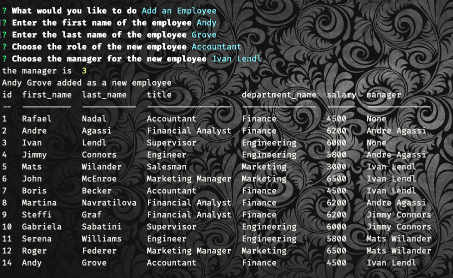
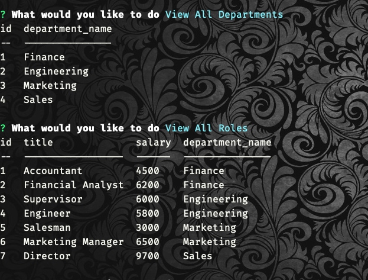

# employee-tracker

## [Application Url](https://noteawesome-taker.herokuapp.com/ )

## [GitHub Url](https://github.com/harry-100/note-taker)

## Description

This app can be used to manage and track employees. This CLI based app can be used to perform various kinds of queries on employee database. Queries can be used to view, update and delete employees, view and update departments, view and update roles. It uses 'inquirer' to get user input and then perform the requisite query to get the required information in a tabular format using 'console.table'.

## Table of Contents

* [Usage](#Usage)
* [License](#License)
* [ScreenShots](#ScreenShots)
* [Questions](#Questions)

## Usage
This app can be invoked using `npm start` on the terminal. Upon start, the user is presented with the options to perform various tasks. Complete overview of the app in action is presented in the walkthrough video, the link of which is given above.

## License
This application is covered under [MIT](
      https://opensource.org/licenses/MIT
      ) license.

## ScreenShots

## Questions
If you need more information, please checkout my [github account](https://github.com/harry-100). You can also reach me via [email](mailto:harvinder.shah@gmail.com?subject=employee-tracker).